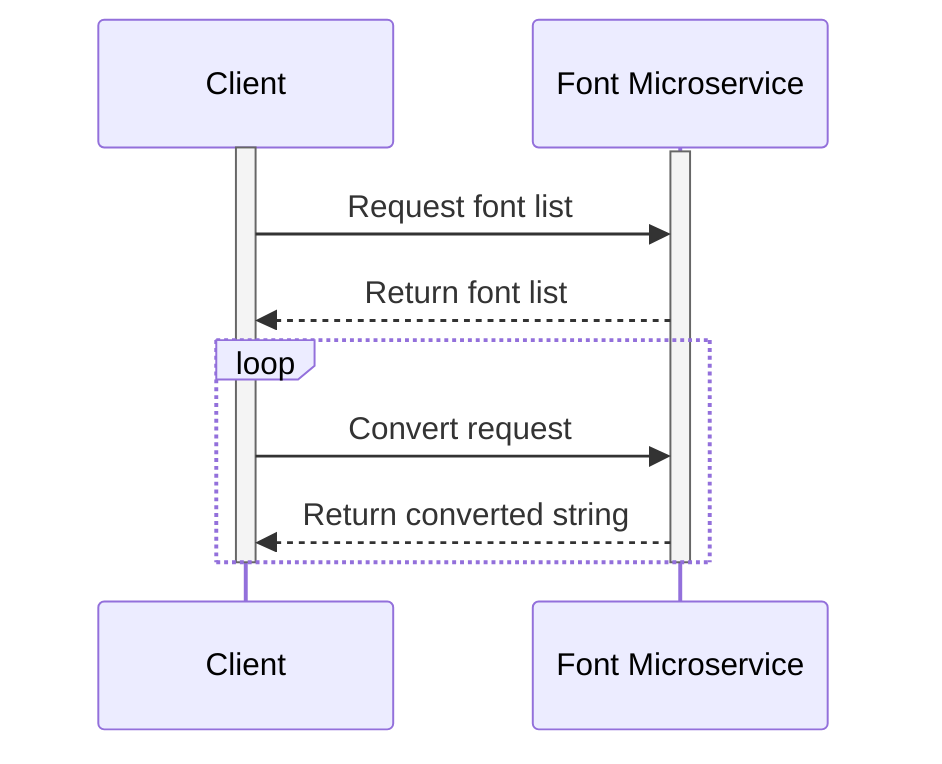

# CS361 Microservice A - Rebecca Klump

## Communication contract

### Request Instructions

All requests are made using the `socket.send_string()` function, with UTF-8 encoding.

Requests consist of a command name, and parameters separated by spaces. There are three commands in total. They are as follows starting with the name and followed by the parameters:

```
convert font userstring
list
sample userstring
```

`convert` takes two parameters, the font to convert to, and the userstring. It converts the userstring to the specified font. The userstring can include spaces, and can be any arbitrary unicode string. Example call:

```
convert cursive Hello world!
```

`list` takes no parameters. It simply returns a comma-seperated list of all the available fonts. Example call:

```
list
```

`sample` takes one parameter, a userstring, just like the convert command. It returns a sample of many different fonts using that userstring, seperated by newlines. Each line starts with the name of the font followed by a colon. Example call:

```
sample The quick brown fox jumps over 12 lazy dogs. (The fox is very talented!)
```

### Receive instructions

All replies to the server are caught with the `socket.recv_string()` instruction, with UTF-8 encoding.

All replies from the server start with a header, either `RES` or `ERR` followed by a space. `RES` is the header when a successful call is made, and `ERR` is the header when there was an error in the command or in the microservice.

Here is an example of a conversation with the microservice, with the client requests prefixed by a `>`

```
> convert cursive Hello world!
RES 𝐻𝑒𝓁𝓁𝑜 𝓌𝑜𝓇𝓁𝒹!
> list
RES boldcursive, boldgothic, circle, cursive, double, fullwidth, gothic
> sample The quick brown fox jumps over 12 lazy dogs. (The fox is very talented!)
RES cursive: 𝒯𝒽𝑒 𝓆𝓊𝒾𝒸𝓀 𝒷𝓇𝑜𝓌𝓃 𝒻𝑜𝓍 𝒿𝓊𝓂𝓅𝓈 𝑜𝓋𝑒𝓇 12 𝓁𝒶𝓏𝓎 𝒹𝑜𝑔𝓈. (𝒯𝒽𝑒 𝒻𝑜𝓍 𝒾𝓈 𝓋𝑒𝓇𝓎 𝓉𝒶𝓁𝑒𝓃𝓉𝑒𝒹!)
gothic: 𝔗𝔥𝔢 𝔮𝔲𝔦𝔠𝔨 𝔟𝔯𝔬𝔴𝔫 𝔣𝔬𝔵 𝔧𝔲𝔪𝔭𝔰 𝔬𝔳𝔢𝔯 12 𝔩𝔞𝔷𝔶 𝔡𝔬𝔤𝔰. (𝔗𝔥𝔢 𝔣𝔬𝔵 𝔦𝔰 𝔳𝔢𝔯𝔶 𝔱𝔞𝔩𝔢𝔫𝔱𝔢𝔡!)
double: 𝕋𝕙𝕖 𝕢𝕦𝕚𝕔𝕜 𝕓𝕣𝕠𝕨𝕟 𝕗𝕠𝕩 𝕛𝕦𝕞𝕡𝕤 𝕠𝕧𝕖𝕣 12 𝕝𝕒𝕫𝕪 𝕕𝕠𝕘𝕤. (𝕋𝕙𝕖 𝕗𝕠𝕩 𝕚𝕤 𝕧𝕖𝕣𝕪 𝕥𝕒𝕝𝕖𝕟𝕥𝕖𝕕!)
fullwidth: Ｔｈｅ ｑｕｉｃｋ ｂｒｏｗｎ ｆｏｘ ｊｕｍｐｓ ｏｖｅｒ １２ ｌａｚｙ ｄｏｇｓ． （Ｔｈｅ ｆｏｘ ｉｓ ｖｅｒｙ ｔａｌｅｎｔｅｄ！）
circle: Ⓣⓗⓔ ⓠⓤⓘⓒⓚ ⓑⓡⓞⓦⓝ ⓕⓞⓧ ⓙⓤⓜⓟⓢ ⓞⓥⓔⓡ ①② ⓛⓐⓩⓨ ⓓⓞⓖⓢ. (Ⓣⓗⓔ ⓕⓞⓧ ⓘⓢ ⓥⓔⓡⓨ ⓣⓐⓛⓔⓝⓣⓔⓓ!)
> convert nullfont Hello world!
ERR Invalid font provided
```

### UML Sequence Diagram



## Mitigation plan

A. Implemented for Alexa

B. This microservice is finished!

C. N/A

D. The code should be run locally, with Python3 and ZMQ.

E. Ask me for help!

F. What errors came up, and what they were trying to do

G. Be sure not to send an empty string! There seems to be a bug in ZMQ.

